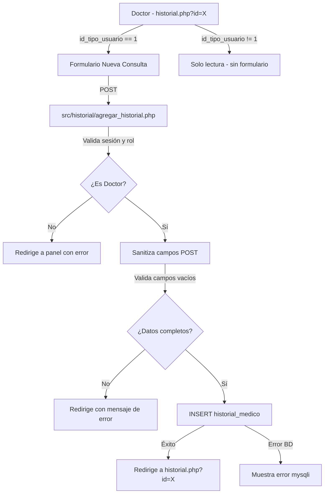
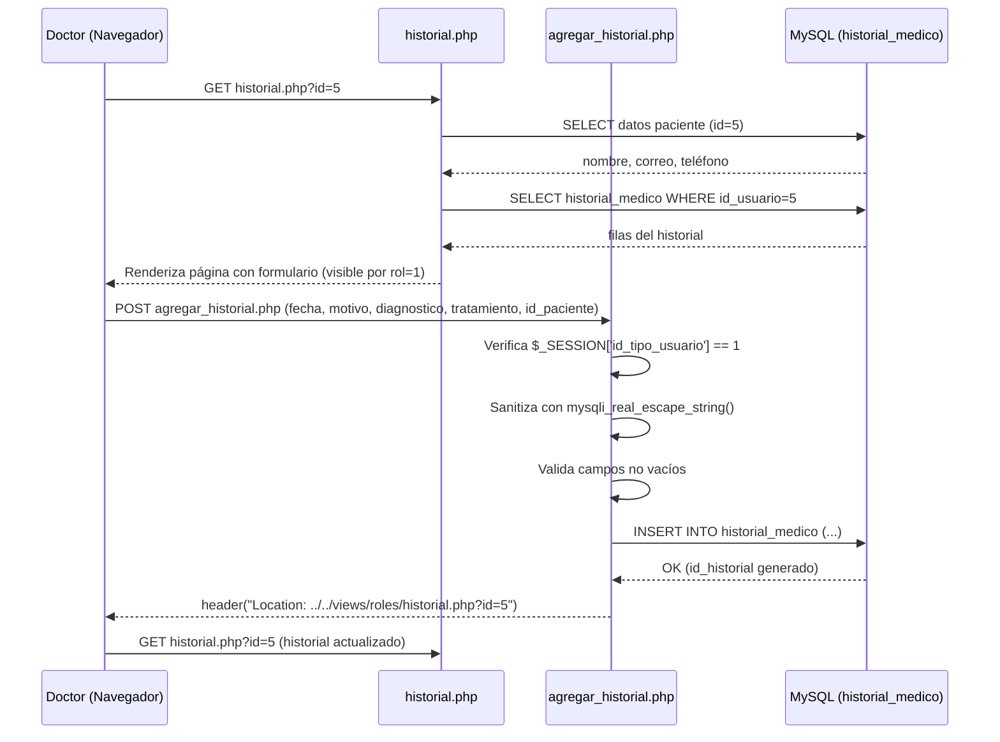
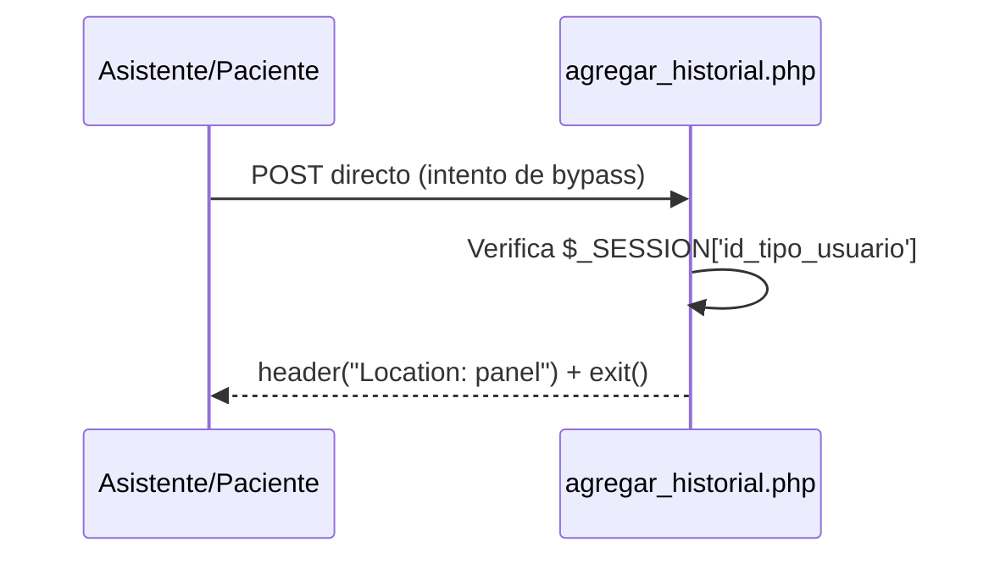

# Documento de Diseño: Historial Médico (Inserción por Doctor)

## Visión General

El módulo de Historial Médico actualmente solo permite **visualizar** el historial de un paciente. Esta funcionalidad extiende `historial.php` para que el doctor (id_tipo_usuario = 1) pueda **agregar nuevas entradas** al historial médico, y crea el archivo de procesamiento `src/historial/agregar_historial.php` que ejecuta el INSERT de forma segura, validando el rol antes de cualquier operación.

El flujo completo es: Doctor abre historial de un paciente → ve formulario de nueva consulta (solo visible para él) → envía el formulario → el procesador valida rol, sanitiza datos e inserta en BD → redirige de vuelta al historial actualizado.

---

## Arquitectura



---

## Diagramas de Secuencia

### Flujo Principal: Doctor agrega entrada al historial



### Flujo de Rechazo: Rol no autorizado intenta POST directo



---

## Componentes e Interfaces

### Componente 1: Formulario en `historial.php`

**Propósito**: Mostrar el formulario de nueva consulta únicamente al doctor, embebido en la vista existente.

**Interfaz HTML/PHP**:
```php
<?php if ($_SESSION['id_tipo_usuario'] == 1): ?>
<section id="form-nueva-consulta">
    <form method="POST" action="../../src/historial/agregar_historial.php">
        <input type="hidden" name="id_paciente" value="<?php echo $id_paciente; ?>">
        <input type="date"   name="fecha_consulta" required>
        <input type="text"   name="motivo"         maxlength="255" required>
        <textarea            name="diagnostico"    required></textarea>
        <textarea            name="tratamiento"    required></textarea>
        <button type="submit">Guardar Consulta</button>
    </form>
</section>
<?php endif; ?>
```

**Responsabilidades**:
- Renderizar el formulario solo cuando `$_SESSION['id_tipo_usuario'] == 1`
- Pasar `id_paciente` como campo oculto para que el procesador sepa a qué paciente asociar el registro
- Aplicar `required` en todos los campos para validación del lado del cliente
- Mantener el estilo inline CSS consistente con el resto de `historial.php`

---

### Componente 2: `src/historial/agregar_historial.php`

**Propósito**: Procesar el POST, validar el rol, sanitizar datos e insertar en `historial_medico`.

**Interfaz PHP**:
```php
<?php
include_once(__DIR__ . '/../../config/db.php');
session_start();

// Contrato de entrada (POST):
// - id_paciente   : int   — ID del paciente (campo oculto del formulario)
// - fecha_consulta: date  — Fecha de la consulta (YYYY-MM-DD)
// - motivo        : string — Motivo de consulta (max 255 chars)
// - diagnostico   : string — Diagnóstico (texto libre)
// - tratamiento   : string — Tratamiento indicado (texto libre)

// Contrato de salida:
// - Éxito  → header("Location: ../../views/roles/historial.php?id={id_paciente}")
// - Error  → header("Location: ../../views/roles/historial.php?id={id_paciente}&error={msg}")
// - No autorizado → header("Location: ../../views/roles/doctor.php") o panel correspondiente
?>
```

**Responsabilidades**:
- Verificar sesión activa (`$_SESSION['usuario_id']`)
- Verificar que `$_SESSION['id_tipo_usuario'] == 1` (solo doctor)
- Sanitizar todos los campos con `mysqli_real_escape_string()`
- Validar que ningún campo obligatorio esté vacío
- Ejecutar el INSERT con prepared statement o escape seguro
- Redirigir al historial del paciente tras éxito

---

## Modelos de Datos

### Tabla: `historial_medico`

```sql
CREATE TABLE historial_medico (
  id_historial    int(11)      NOT NULL AUTO_INCREMENT,
  id_usuario      int(11)      NOT NULL,          -- FK → usuario.id_usuario (paciente)
  fecha_consulta  date         NOT NULL,
  motivo          varchar(255) NOT NULL,
  diagnostico     text         NOT NULL,
  tratamiento     text         NOT NULL,
  fecha_registro  datetime     DEFAULT current_timestamp(),
  PRIMARY KEY (id_historial),
  FOREIGN KEY (id_usuario) REFERENCES usuario(id_usuario) ON DELETE CASCADE
);
```

**Reglas de validación**:
- `id_usuario` debe existir en `usuario` con `id_tipo_usuario = 3` (paciente)
- `fecha_consulta` no puede ser nula; se acepta fecha pasada o presente
- `motivo` no puede estar vacío; máximo 255 caracteres
- `diagnostico` y `tratamiento` no pueden estar vacíos
- `fecha_registro` se genera automáticamente por la BD (no se envía desde el formulario)

---

## Pseudocódigo Algorítmico

### Algoritmo Principal: `agregar_historial.php`

```pascal
ALGORITHM procesarAgregarHistorial
INPUT:  $_POST (id_paciente, fecha_consulta, motivo, diagnostico, tratamiento)
        $_SESSION (usuario_id, id_tipo_usuario)
OUTPUT: Redirección HTTP

BEGIN
  // Paso 1: Incluir conexión y arrancar sesión
  include_once('config/db.php')
  session_start()

  // Paso 2: Verificar sesión activa
  IF NOT isset($_SESSION['usuario_id']) THEN
    header("Location: ../../views/auth/login.php")
    exit()
  END IF

  // Paso 3: Verificar que el usuario sea Doctor (rol = 1)
  IF $_SESSION['id_tipo_usuario'] ≠ 1 THEN
    // Determinar panel de regreso según rol
    IF $_SESSION['id_tipo_usuario'] = 2 THEN
      header("Location: ../../views/roles/asistente.php")
    ELSE
      header("Location: ../../views/roles/paciente.php")
    END IF
    exit()
  END IF

  // Paso 4: Leer y sanitizar campos del POST
  id_paciente    ← mysqli_real_escape_string($conexion, $_POST['id_paciente'])
  fecha_consulta ← mysqli_real_escape_string($conexion, $_POST['fecha_consulta'])
  motivo         ← mysqli_real_escape_string($conexion, trim($_POST['motivo']))
  diagnostico    ← mysqli_real_escape_string($conexion, trim($_POST['diagnostico']))
  tratamiento    ← mysqli_real_escape_string($conexion, trim($_POST['tratamiento']))

  // Paso 5: Validar que ningún campo esté vacío
  IF empty(id_paciente) OR empty(fecha_consulta) OR
     empty(motivo) OR empty(diagnostico) OR empty(tratamiento) THEN
    header("Location: ../../views/roles/historial.php?id=" + id_paciente + "&error=campos_vacios")
    exit()
  END IF

  // Paso 6: Ejecutar INSERT
  sql ← "INSERT INTO historial_medico
           (id_usuario, fecha_consulta, motivo, diagnostico, tratamiento)
         VALUES
           ('id_paciente', 'fecha_consulta', 'motivo', 'diagnostico', 'tratamiento')"

  resultado ← mysqli_query($conexion, sql)

  // Paso 7: Evaluar resultado y redirigir
  IF resultado = TRUE THEN
    header("Location: ../../views/roles/historial.php?id=" + id_paciente)
  ELSE
    error_msg ← urlencode(mysqli_error($conexion))
    header("Location: ../../views/roles/historial.php?id=" + id_paciente + "&error=" + error_msg)
  END IF

  exit()
END
```

**Precondiciones**:
- `$conexion` está disponible y activa (incluida desde `config/db.php`)
- La sesión PHP está iniciada
- El formulario fue enviado por método POST

**Postcondiciones**:
- Si el rol es válido y los datos son completos: existe una nueva fila en `historial_medico`
- El navegador siempre recibe una redirección HTTP (nunca una página en blanco)
- No se producen mutaciones en la BD si el rol no es Doctor

**Invariantes de bucle**: No aplica (no hay iteraciones)

---

### Algoritmo de Renderizado del Formulario en `historial.php`

```pascal
ALGORITHM renderizarFormularioCondicional
INPUT:  $_SESSION['id_tipo_usuario']
        $id_paciente (ya sanitizado desde $_GET['id'])
OUTPUT: HTML del formulario (o nada si no es doctor)

BEGIN
  IF $_SESSION['id_tipo_usuario'] = 1 THEN
    RENDER sección "Agregar Nueva Consulta"
    RENDER <form method="POST" action="../../src/historial/agregar_historial.php">
      RENDER <input type="hidden" name="id_paciente" value=id_paciente>
      RENDER <input type="date"   name="fecha_consulta" required>
      RENDER <input type="text"   name="motivo" maxlength="255" required>
      RENDER <textarea name="diagnostico" required>
      RENDER <textarea name="tratamiento" required>
      RENDER <button type="submit">Guardar Consulta</button>
    RENDER </form>
  END IF
  // Si no es doctor: no se renderiza nada (sin mensaje de error visible)
END
```

**Precondiciones**:
- `$_SESSION['id_tipo_usuario']` está definido (garantizado por la validación de sesión previa)
- `$id_paciente` ya fue sanitizado antes de este punto

**Postcondiciones**:
- Solo el doctor ve el formulario en el HTML generado
- Asistentes y pacientes reciben el HTML sin ningún rastro del formulario

---

## Especificaciones Formales de Funciones Clave

### Función: Validación de Rol

```php
function esDoctor(): bool
```

**Precondiciones**:
- `session_start()` fue llamado previamente
- `$_SESSION['id_tipo_usuario']` está definido

**Postcondiciones**:
- Retorna `true` si y solo si `$_SESSION['id_tipo_usuario'] === 1`
- No produce efectos secundarios

### Función: Sanitización de Entrada

```php
function sanitizarCampo(mysqli $conexion, string $valor): string
```

**Precondiciones**:
- `$conexion` es una conexión MySQLi activa
- `$valor` es un string (puede estar vacío)

**Postcondiciones**:
- Retorna el string con caracteres especiales escapados para uso seguro en SQL
- El valor original no es modificado
- Nunca retorna `null`

---

## Manejo de Errores

### Escenario 1: Sesión no activa

**Condición**: `$_SESSION['usuario_id']` no existe al llegar a `agregar_historial.php`  
**Respuesta**: `header("Location: ../../views/auth/login.php")` + `exit()`  
**Recuperación**: El usuario debe autenticarse nuevamente

### Escenario 2: Rol no autorizado (bypass de formulario)

**Condición**: `$_SESSION['id_tipo_usuario'] != 1` en `agregar_historial.php`  
**Respuesta**: Redirección al panel correspondiente según rol, sin mensaje de error visible al usuario  
**Recuperación**: El usuario es enviado a su panel sin que se ejecute ninguna operación en BD

### Escenario 3: Campos vacíos o faltantes

**Condición**: Algún campo POST llega vacío (puede ocurrir si se deshabilita el `required` del navegador)  
**Respuesta**: `header("Location: historial.php?id=X&error=campos_vacios")` + `exit()`  
**Recuperación**: `historial.php` puede leer `$_GET['error']` y mostrar un aviso al doctor

### Escenario 4: Error de base de datos en INSERT

**Condición**: `mysqli_query()` retorna `false`  
**Respuesta**: Redirección con `&error=` conteniendo el mensaje de `mysqli_error()` (URL-encoded)  
**Recuperación**: El doctor ve el mensaje de error en el historial; no se pierde el contexto del paciente

### Escenario 5: ID de paciente inválido

**Condición**: `$_POST['id_paciente']` no corresponde a un usuario con `id_tipo_usuario = 3`  
**Respuesta**: La FK de la BD rechazará el INSERT; se captura como error de BD (Escenario 4)  
**Recuperación**: Igual que Escenario 4

---

## Estrategia de Pruebas

### Pruebas Unitarias

| Caso | Entrada | Resultado Esperado |
|------|---------|-------------------|
| Doctor con datos completos | rol=1, todos los campos llenos | INSERT exitoso, redirección a historial |
| Asistente intenta POST | rol=2, datos completos | Sin INSERT, redirección a asistente.php |
| Paciente intenta POST | rol=3, datos completos | Sin INSERT, redirección a paciente.php |
| Sin sesión activa | sin `$_SESSION['usuario_id']` | Redirección a login.php |
| Campo motivo vacío | rol=1, motivo="" | Sin INSERT, redirección con error=campos_vacios |
| Campo diagnóstico vacío | rol=1, diagnostico="" | Sin INSERT, redirección con error=campos_vacios |
| ID paciente inexistente | rol=1, id_paciente=9999 | Error de FK en BD, redirección con error |

### Pruebas de Propiedad

**Propiedad 1 — Exclusividad de escritura**:  
Para todo usuario con `id_tipo_usuario ≠ 1`, ninguna llamada a `agregar_historial.php` debe producir una nueva fila en `historial_medico`.

**Propiedad 2 — Integridad de datos**:  
Para todo INSERT exitoso, la fila resultante en `historial_medico` debe tener exactamente los valores enviados en el POST (sin truncamiento ni alteración), y `fecha_registro` debe ser generada por la BD.

**Propiedad 3 — Idempotencia de la vista**:  
El formulario en `historial.php` solo aparece en el HTML cuando `$_SESSION['id_tipo_usuario'] == 1`; para cualquier otro valor de sesión, el HTML no contiene el elemento `<form>` de inserción.

### Pruebas de Integración

- Flujo completo: Login como doctor → abrir historial de paciente → llenar formulario → verificar nueva fila en BD → verificar redirección correcta
- Flujo de seguridad: Login como asistente → intentar POST directo a `agregar_historial.php` → verificar que no hay nueva fila en BD

---

## Consideraciones de Seguridad

- **Validación de rol en servidor**: La verificación de `id_tipo_usuario == 1` ocurre en `agregar_historial.php`, no solo en el cliente. El formulario oculto en HTML es una medida de UX, no de seguridad.
- **Sanitización con MySQLi**: Todos los campos POST pasan por `mysqli_real_escape_string()` antes de ser interpolados en la query SQL.
- **Sin exposición de errores en producción**: Los mensajes de `mysqli_error()` se pasan como parámetro URL; en producción se recomienda loguear en servidor y mostrar mensaje genérico al usuario.
- **Validación de tipo de usuario del paciente**: La FK en BD garantiza que `id_usuario` exista en `usuario`, pero no que sea un paciente (tipo 3). Se puede agregar una validación adicional en el procesador si se requiere mayor rigor.
- **CSRF**: El proyecto no implementa tokens CSRF actualmente; se mantiene consistencia con el patrón existente (ver `finalizar_cita.php`).

---

## Consideraciones de Rendimiento

- Las consultas son simples SELECT/INSERT sobre tablas pequeñas; no se requiere indexación adicional más allá de la FK existente en `id_usuario`.
- No se usa paginación en el historial; si el volumen de registros crece, se puede agregar `LIMIT` con paginación en una iteración futura.

---

## Dependencias

| Dependencia | Tipo | Descripción |
|-------------|------|-------------|
| `config/db.php` | Interna | Conexión MySQLi al puerto 3307 |
| `$_SESSION['usuario_id']` | Runtime | Garantiza que el usuario está autenticado |
| `$_SESSION['id_tipo_usuario']` | Runtime | Determina el rol para control de acceso |
| Tabla `historial_medico` | BD | Destino del INSERT |
| Tabla `usuario` | BD | FK que valida que el paciente exista |

---

## Estructura de Archivos a Crear/Modificar

```
AgendaVital/
├── views/roles/
│   └── historial.php          ← MODIFICAR: agregar formulario condicional
└── src/
    └── historial/
        └── agregar_historial.php  ← CREAR: procesador del formulario
```
