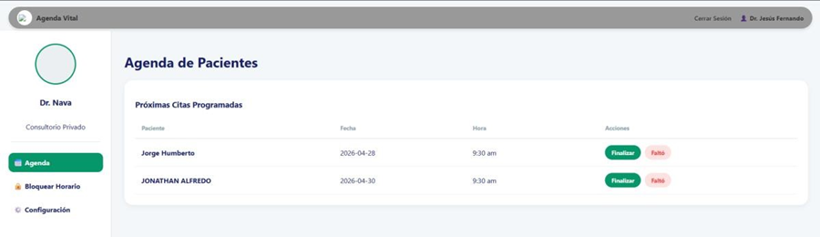
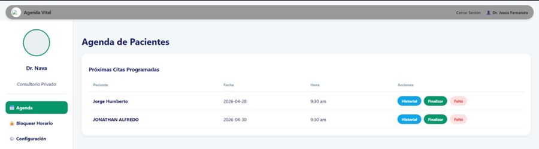
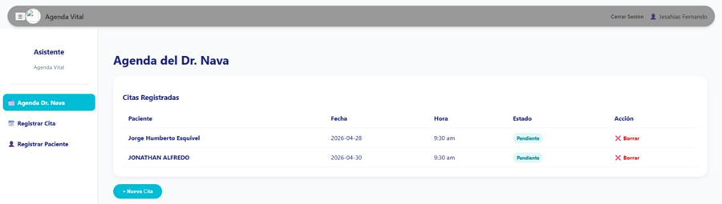
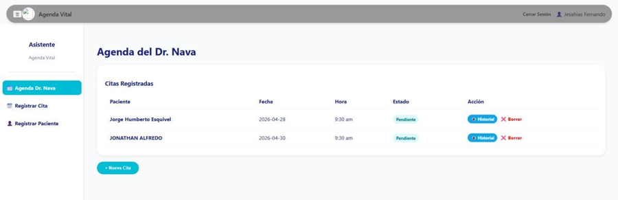
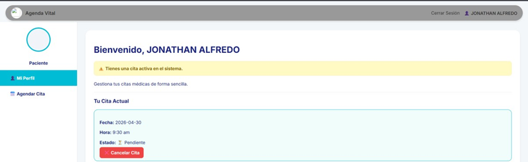
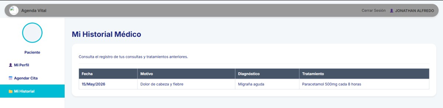

# Reporte de Ajuste de Interfaz y Diseño - Sprint 5

## 1. Identificación del Proyecto y Equipo
* **Institución:** Instituto Tecnológico Superior de San Pedro de las Colonias
* **Carrera:** Ingeniería en Sistemas Computacionales
* **Materia:** Ingeniería de Software (Grupo: 6A)
* **Docente:** Ruth Aivi Chávez Rodríguez
* **Equipo:** "Los Navitas"
* **Integrantes:**
  * Jorge Humberto Esquivel Cuellar
  * Jesús Javier Martínez Hernández
  * Jesús Fernando Rodríguez Nava
  * Jonathan Alfredo Rodríguez Ramírez
  * Jesahias Fernando Juarez Palacios

---

## 2. Resumen de la Actualización y Objetivo Visual
A raíz de la retroalimentación externa, se implementó el acceso y la visualización del nuevo **Historial Médico** en los tres perfiles principales del sistema: **Doctor, Asistente y Paciente**. 

El objetivo primordial del diseño fue integrar esta nueva funcionalidad de manera armónica, utilizando un sistema de tarjetas y menús laterales con botones de acción rápida y nuevas pestañas de navegación, respetando la paleta de colores y la arquitectura de información preexistente para evitar saturar las pantallas.

---

## 3. Evidencias del Ajuste Visual (Antes y Después)

### A. Vista del Médico (Doctor Dashboard)
Se optimizó la tabla de *"Próximas Citas Programadas"* para otorgar al médico acceso directo al expediente clínico antes de atender o finalizar la consulta.

* **Problema Detectado (Antes):** La columna de "Acciones" únicamente permitía "Finalizar" (botón verde) y "Faltó" (botón rojo claro). El médico no tenía un acceso rápido para consultar antecedentes del paciente.
* **Solución Aplicada (Después):** Se integró un nuevo botón llamado **Historial** (color azul) alineado a la izquierda dentro de la misma columna de acciones. Se eligió el azul para destacarlo como una acción de consulta/lectura sin restar peso visual a los botones de acciones definitivas.

| Antes del Cambio | Después del Cambio |
| :---: | :---: |
|  |  |

---

### B. Vista de Recepción (Asistente Dashboard)
Para empoderar al personal administrativo en la atención al mostrador, se homologó la tabla de citas con la interfaz del médico.

* **Problema Detectado (Antes):** En la sección de *"Citas Registradas"*, la columna de acciones solo permitía eliminar el registro mediante el botón "X Borrar" (texto rojo).
* **Solución Aplicada (Después):** Se agregó el botón **Historial** (azul) con diseño tipo píldora (*pill-button*) a la izquierda del botón de borrado. Esto permite al asistente verificar rápidamente las visitas previas del paciente si este lo solicita en mostrador o vía telefónica.

| Antes del Cambio | Después del Cambio |
| :---: | :---: |
|  |  |

---

### C. Vista del Paciente (Patient Dashboard)
Se modificó la arquitectura de información para brindarle al paciente plena autonomía sobre sus propios datos médicos.

* **Problema Detectado (Antes):** El menú lateral izquierdo era muy limitado; solo contaba con dos secciones disponibles: *"Mi Perfil"* y *"Agendar Cita"*.
* **Solución Aplicada (Después):** Se añadió una tercera sección en el menú lateral denominada **"Mi Historial"**. Al seleccionarla, el área de contenido principal cambia para mostrar una tabla limpia con el registro histórico de sus consultas (Fecha, Motivo, Diagnóstico y Tratamiento), manteniendo el diseño de tarjeta blanca con bordes redondeados del sistema.

| Antes del Cambio | Después del Cambio |
| :---: | :---: |
|  |  |

---

## 4. Nueva Pantalla Creada: Expediente Clínico Detallado
Además de modificar los componentes de las interfaces existentes, se diseñó una vista completamente nueva (Clean UI) que se despliega cuando el Doctor o el Asistente hacen clic en el botón "Historial":

* **Cabecera de Identificación:** Un panel superior destacado con fondo azul claro que muestra el nombre del paciente, su correo y teléfono para identificar rápidamente el expediente en uso.
* **Tabla de Registros:** Un diseño de tabla limpio que enlista cronológicamente los motivos de consulta, diagnósticos y tratamientos recetados.
* **Navegación Intuitiva:** Se incluuyó un botón de retorno **"<- Volver al Panel"** en la parte superior izquierda, asegurando que el usuario no pierda su flujo de trabajo y pueda regresar con un solo clic.

